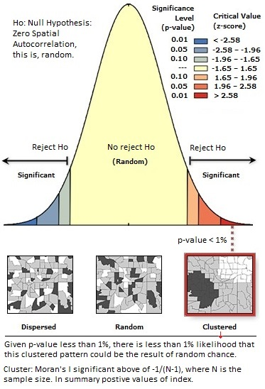
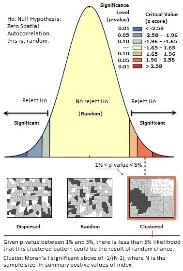

```{r, include = FALSE}
knitr::opts_chunk$set(
  collapse = TRUE,
  comment = "#>"
)
```

Acknowledgment: Work done in collaboration with @cemelo2016.
Contact information:  [Alexys H Rodríguez](mailto:alexys.hr@uni-muenster.de), [Carlos E Melo](mailto:carlosm7@gmail.com)

# 1. Introduction

@anselin1995 and @ordgetis1995 introduced the classic exploratory data analysis techniques to test local indicators of spatial association - LISA, showing its relation with global indicators, such as Moran's I @moran1950, in the univariate context. This package has been create to deal with global and local indicators of spatial association, but in the bivariate context.

## 1.1. Motivation

Despite it is possible to find software examples of bivariate spatial autocorrelation in areal data, as @ade, there is not common to find R package focused in bivariate context. The package 'spdepbi' is a contribution in this regard. It is important to analyze mutual influences of variables to analyze spatial dependences in lattice data.

## 1.2. Package Warnings

The only one warning that the package 'spdepbi' send at compiling time will fix itself automatically when packages 'spdep' and 'spatialreg' complete their migration process, see @spsp.


```{r setup}
library(spdepbi)
```

# 2. Data Description & Exploration

The 49 neighbourhoods in Columbus, OH (1980) dataset with data related to crime, housing and income, will be used for the analysis, see @anselin1988. The variables of interest are HOVAL, INCOME (INC) and CRIME, namely housing value (in \$1,000), household income (in \$1,000), and residential burglaries and vehicle thefts per 1000 households respectively. The spatial reference system is unknown.

```{r}
library(sf)
library(spdep)
columbus <- st_read(system.file("extdata/columbus.shp", package="spdepbi")[1], quiet=TRUE)
```

The exploratory data analysis (EDA) of areal data include the creation of spatial neighbours information and its related spatial weights @arealpebesma. Spatial neigbours lists hold a relationship of the areas that are in the vicinity of other areas, and can be done taking into consideration the order or closeness. First order are the closer ones polygons, namely the first neighbourhood ring, and as the order increases, subsequent neighbourhood rings (increased radius - farther distances) are created. There are two typical styles to construct neighbour information for areal entities, rook contiguity (common edge), and queen contiguity (common edge or common vertex), see @anselin2006. Weights are related with distance between neighbour links, if distances are short weights increase, showing a measure of spatial dependence reflecting Tobler's first law. There are many ways to assigns weights to neighbours lists, see @tiefelsdorf2000, and 'nb2listw' in 'spdep' package, @spdep. Used format of spatial data in this case study is simple features, see @sf.

For the case study data, next code will construct the neighbours list with queen style (poly2nb), then will calculate from 1 to 6 orders of neighbours (nblag), followed by the plot of the areal units borders, and finally will join with a red line all the polygon's centroids on the fifth neighbourhood ring (order).

```{r}
coords = st_geometry(st_centroid(columbus$geometry))
col_nbq <- poly2nb(columbus)                    # Queen-Style
par.lags1 <- nblag(col_nbq, 6)                  # Order 6
plot(st_geometry(columbus), border="grey")
plot(par.lags1[[5]], coords, add=TRUE, col="red", lty=2)
```

Next code, use row standarized (W) method to assign weights to the previous queen-style (col_nbq) neighbours list and shows a summary of the neighbours-weights. 


```{r}
a.lw <- nb2listw(col_nbq, style="W")
summary(a.lw)
```

Following EDA, next chunk of code, will display the first (with labels) and second order neighbours for the polygon with ID equal to 25, using the rook-style.  

```{r}
##Rook-Style
columbus <- st_read(system.file("extdata/columbus.shp", package="spdepbi")[1], quiet=TRUE)
plot(st_geometry(columbus))
coords = st_geometry(st_centroid(columbus$geometry))
p1 = st_point(c(8.940741,12.35734))
(p1 = st_sfc(p1))
(polcontain = st_within(p1,columbus))
(myPol = which(as.matrix(polcontain)))
result = columbus[myPol, ]
#Get centroid of selected polygon and plot its ID
centroidsp <- st_geometry(st_centroid(result$geometry))
text(st_coordinates(centroidsp)[,1],st_coordinates(centroidsp)[,2],columbus[myPol,]$POLYID)
col_nbr <- poly2nb(columbus,queen=F)            # rook-style
col.lags10 <- nblag(col_nbr, 10)                # Order 10
#Plot first and second order polygons
plot(st_geometry(columbus[col.lags10[[1]][[myPol]],]), col = "springgreen4", add = TRUE)
plot(st_geometry(columbus[col.lags10[[2]][[myPol]],]), col = "yellow4", add = TRUE)
#Get centroid of first order neighbours
centroids <- st_geometry(st_centroid(columbus[col.lags10[[1]][[myPol]],]$geometry))
#plot text of first order neighbours
text(st_coordinates(centroids)[,1],st_coordinates(centroids)[,2],columbus[col.lags10[[1]][[myPol]],]$POLYID ,cex=0.8)
```

And using queen-style:

```{r}
##Queen-Style
plot(st_geometry(columbus))
coords = st_geometry(st_centroid(columbus$geometry))
p1 = st_point(c(8.940741,12.35734))
(p1 = st_sfc(p1))
(polcontain = st_within(p1,columbus))
(myPol = which(as.matrix(polcontain)))
result = columbus[myPol, ]
#Get centroid of selected polygon and plot its ID
centroidsp <- st_geometry(st_centroid(result$geometry))
text(st_coordinates(centroidsp)[,1],st_coordinates(centroidsp)[,2],columbus[myPol,]$POLYID)
col_nbq1 <- poly2nb(columbus)                   #Queen
col.lags10 <- nblag(col_nbq1, 10)               #Order 10
#Plot first and second order polygons
plot(st_geometry(columbus[col.lags10[[1]][[myPol]],]), col = "springgreen4", add = TRUE)
plot(st_geometry(columbus[col.lags10[[2]][[myPol]],]), col = "yellow4", add = TRUE)
#Get centroid of first order neighbours
centroids <- st_geometry(st_centroid(columbus[col.lags10[[1]][[myPol]],]$geometry))
#plot text of first order neighbours
text(st_coordinates(centroids)[,1],st_coordinates(centroids)[,2],columbus[col.lags10[[1]][[myPol]],]$POLYID ,cex=0.8)
```

# 3. Data Analysis {#dataanalysis}

With the weights inside the neighbour list (a.lw), bivariate spatial autocorrelation using variables CRIME, INCOME and HOVAL, will be analyzed. 

```{r}
CRIME <- columbus$CRIME
INCOME <- columbus$INC
HOVAL <- columbus$HOVAL
```

## 3.1. Bivariate Moran's I (moran.bi) {#moranbi}

Analysis of the global bivariate spatial autocorrelation of Columbus dataset taking into consideration variables CRIME and INCOME.

```{r moran.bi, warning=FALSE}
moran.bi(CRIME,INCOME,a.lw,zero.policy =T)
```

The expected value for no autocorrelation is -0.02, from -1/(N-1), where N equals 49 (number of polygons). The Bivariate Moran's I equal to -0.4286 seems significant below to -0.02, which may indicate that the global bivariate spatial autocorrelation is dispersed (spatial outliers) in the dataset.


## 3.2 Formal Test for Bivariate Moran's I (moranbi.test) {#moranbitest}

Analysis of the significance of bivariate Moran's I (observed value = -0.4286) to declare global dispersed behavior for CRIME and INCOME in the dataset, but first, in the following graphics is described the hypothesis test method using the p-value or z-score statistics when dealing with Moran's I.

```{r, fig.cap='Hypothesis Testing - 1', out.width = '350px' }

```

See the interpretation at the bottom of previous graphic.

Observed value for CRIME and INCOME, will be compared with the expected value empirical density constructed with MonteCarlo simulations.

```{r, warning=FALSE}
set.seed(123)
MBCrime <- moranbi.test(CRIME,INCOME,a.lw,999,graph=T,zero.policy =T,N=1000)
```

According to previous graphic and the resulting p-value (0.000999001), there is less than 0.1% likelihood that this dispersed spatial pattern between CRIME and INCOME could be the result of random chance.

Next the analysis between INCOME and HOVAL.

```{r, warning=FALSE}
moranbi.test(INCOME,HOVAL,a.lw,999,graph=T,zero.policy =T,N=1000)
```

The observed bivariate Moran's I between INCOME and HOVAL of 0.1646, suggest clustered spatial autocorrelation. According to previous graphic and the resulting p-value (0.01098), there is less than 5% likelihood that this clustered pattern could be the result of random chance.

## 3.3. Plot of Bivariate Spatial Autocorrelation (moranbi.plot)

Bivariate spatial autocorrelation can be seen graphically (moranbi.plot) using spatial lags plots of scaled variables. Method used to create spatial lag values in morambi.plot is 'lag.listw', and is explained in pages 257 and 258 of @arealpebesma. With scale function of R base, it is possible to transform CRIME and INCOME, to have the same relative scale of values for comparative analysis.

```{r}
CRIME <- as.vector(scale(columbus$CRIME))
INCOME <- as.vector(scale(columbus$INC))
moranbi.plot(CRIME,INCOME,quiet =F,zero.policy =F,listw=a.lw)
```

Previous graphic shows the negative correlation trend between scaled-lag variables INCOME and CRIME, pointing five potentially influential observations (IDs: 32, 47, 17, 30, and 7), this is, atypical observations that not follow the displayed pattern.

## 3.4. Local Bivariate Spatial Autocorrelation with Moran's I (localmoran.bi) {#localmoranbi}

As proposed by @anselin1995 and @ordgetis1995 with univariate Moran's I global indicator to be scaled in the context of local indicators (LISA), it is possible to calculate for each areal unit the local bivariate
spatial autocorrelation index and its corresponding transformation to z-scores, which could be used to 
evaluate the significance of each local index.

```{r}
CRIME <- columbus$CRIME
INCOME <- columbus$INC
HOVAL <- columbus$HOVAL
localmoran.bi(CRIME, INCOME, a.lw, zero.policy=FALSE, alternative="two.sided")
```

Interpretation of local index is similar to [3.1. moran.bi](#moranbi). Interpretation of its significance is similar to [3.2. moranbi.test](#moranbitest), but usign z-score instead of p-value. Legend in next graphic shows typical significant values of p-value (alpha) and its equivalent z-score values.

```{r, fig.cap='Hypothesis Testing - 2', out.width = '350px'}

```

## 3.5. LISA Spatial Autocorrelation and Significicance Map (moran.cluster) {#morancluster}

Local spatial autocorrelation behavior can be seen in a map for the univariate approach. With a recursive use of the function 'localmoran' of 'spdep' package, it is possible to calculate local Moran's I for CRIME variable for each spatial unit, and then compare resulting p-values to establish significance of the index, represented as a choropleth map. Method and concept to evaluate significance is similar to [3.2. moranbi.test](#moranbitest). 

Next 'moran.cluster' function will create two maps: Lisa Cluster Map and Lisa Significance Map. Cluster Map can represent similar or dissimilar value concentrations, namely spatial clusters or spatial outliers (dispersed) respectively, and this behavior can be detected analyzing the resulting global univariate Moran's I, generally positive values means cluster, and negative values means dispersed (expected value is different for each case and depends of number of observations: -1/(N-1))

```{r}
moran.cluster(CRIME, a.lw, zero.policy = FALSE, columbus, significant=T)
```

## 3.6. Getis Gi* Spatial Autocorrelation and Significicance Map (getis.cluster) {#getiscluster}

Similar to [3.5. moran.cluster](#morancluster), but using local Gi* (function 'localG' of 'spdep').

```{r}
getis.cluster(CRIME, a.lw, zero.policy = FALSE, columbus, significant=T)
```

# 4. Discussion

With 'spdepbi' is possible to calculate, test and show graphically global and local bivariate Moran's I for lattice data, and create clusters and significance maps for local univariate Getis* and Moran's I.

It is possible to combine results of function 'localmoran.bi' (see [3.4. localmoran.bi](#localmoranbi)) with function 'moran.cluster' (see [3.5. moran.cluster](#morancluster)) to evaluate if the if resulting local index correspond to a cluster, random, or dispersed behavior for each spatial unit. Same conclusion applies using function 'localG' of 'spdep' and [3.6. getis.cluster](#getiscluster).

Conclusions about data analysis of Columbus dataset was done in each subtitle of [3. Data Analysis](#dataanalysis).

# References
